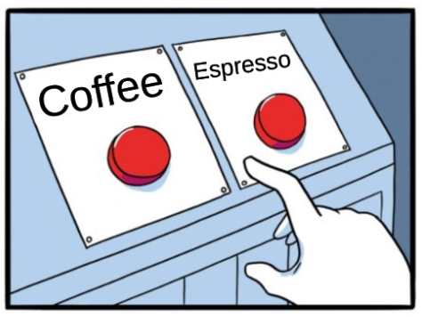

# coffee-ui

My React + TypeScript solution to a coding challenge: a UI component that
remotely controls a coffee machine which can dispense **coffee** or **espresso**.




*Clicking Coffee or Espresso places an order and bumps that drink's counter; clicking the same drink again cancels it, and clicking the other drink cancels the first order. (The component is intentionally unstyled — the buttons sit top-left.)*

## The problem

Render two buttons that each show how many drinks have been dispensed
(`Coffee (42)`, `Espresso (17)`). Clicking a button places an order and bumps its
counter. The machine makes **one beverage at a time**, so:

- clicking the same drink again **cancels** the pending order (counter goes back);
- clicking the other drink **cancels** the first order and starts the new one.

The buttons carry the classes `coffeeBtn` / `espressoBtn`, and each count lives in
a `span` with the class `coffees` / `espressos`.

## My approach

The whole thing is one small state machine. A single `order` state holds which
drink is currently pending — `'none'`, `'coffee'` or `'espresso'` — because the
machine can only have one order at a time.

- Displayed counts are derived, not stored: `42`/`17` plus one if that drink is
  the pending order.
- Clicking a drink **toggles** it (pending → none) or switches the pending order
  from the other drink, which naturally cancels it.

This keeps the two buttons mutually exclusive without any extra bookkeeping. See
[`src/CoffeeUI.tsx`](./src/CoffeeUI.tsx); the behaviour is pinned by the nine tests
in [`src/CoffeeUI.spec.tsx`](./src/CoffeeUI.spec.tsx).

Deriving the counts from a single state avoids an earlier approach that stored
each counter separately and bumped them inside `setTimeout`, which was racy and
let the two orders drift out of sync.

## Run it

```bash
npm install
npm test     # run the test suite
npm start    # open the component in the browser
```

**Built with:** React 17, TypeScript, Create React App, Jest and React Testing
Library.

## About

My solution to a take-home coding challenge.

## License

This project is licensed under the MIT License — see the [LICENSE](LICENSE) file.
